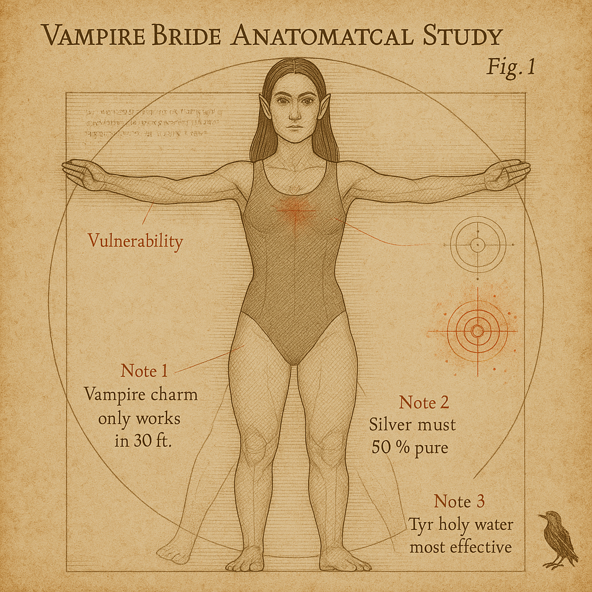

# Correspondence from Vellynne Harpell
## Tenth Black Staff of Blackstaff Academy
### 1489 DR, Hammer - To: Rothbart

*Delivered by raven familiar*

---

Dear Rothbart,

I trust this correspondence finds you in good health and spirits, though I imagine the mere sight of my familiar delivers you some measure of displeasure. My informants among the Goliaths and the ever-mysterious Northwatch Rangers have kept me apprised of your recent encounter with vampires and yetis at East Haven.

Your dedication to your oath remains admirable, if somewhat ironic given your current condition. I find it delightfully paradoxical how you, a being sustained by the very necromantic energies you despise, marked a vampire with your radiant sword and smote it with divine energy. The dampir hunting vampires—nature truly has a sense of humor that escapes even the most learned scholars. I'm told your Divine Smite was particularly effective, it is good to know your current state does not diminish your devotion to your oath. How fascinating that the powers of light still answer one who walks in twilight.

The vampires you encountered were likely brides of an Elder vampire. Tradition dictates that greater vampires typically maintain three such brides, suggesting at least one more remains at large. By destroying two of them, you've undoubtedly placed yourselves squarely in the Elder's sights. A word of caution: such beings are patient and vindictive in equal measure. I would advise maintaining wards against scrying and charm effects, particularly given how one vampire's "otherworldly" charm nearly ensnared several of your companions.

I would be most grateful if you could provide additional details regarding the female voice that cast Lightning Bolt from within the crowd—purely for academic documentation, I assure you. Of particular interest is how your dampir senses responded to her presence. Was there something unusual about her aura? Such information would significantly contribute to my ongoing research into magical signatures, which I know you find distasteful yet might one day help you reconcile the duality of your existence.

Despite our philosophical differences, I've taken the liberty of working with Northwatch to prevent the fallen from rising as undead. I've added certain alchemical compounds to the corpses—nothing necromantic, I assure you—that will make them easier to track should someone attempt to raise them. Additionally I included some wards that will aid me in determining the nature of their resurrection. A corpse pile of that magnitude will prove difficult for our enemies to resist, creating an opportunity to identify those responsible.

Do take care in your continued explorations, dear half-undead paladin. I'm pleased to report that while casualties occurred, most of the townsfolk survived the attack. Multiple witnesses noted that the awakened animals seemed focused on keeping defenders away from your group, suggesting you were the primary targets. This targeted nature of the attack warrants further investigation. I eagerly await your arrival at The Northlook Inn in Bryn Shander, where I can share additional information that shouldn't be committed to parchment.

With scholarly interest and perpetual amusement,

*Vellynne Harpell*
Tenth Black Staff of Blackstaff Academy

P.S. 

The Goliath leader has expressed interest in meeting the "Yeti Slayer" again. I presume this refers to Glarkul, who I understand delivered the killing blow to three of the four yetis. I cannot fathom what such a meeting might entail, but I thought it prudent to pass along the message.

---

**Enclosed:**
- A small vial of silvered oil that can be applied to weapons (effective against both vampires and lycanthropes)

